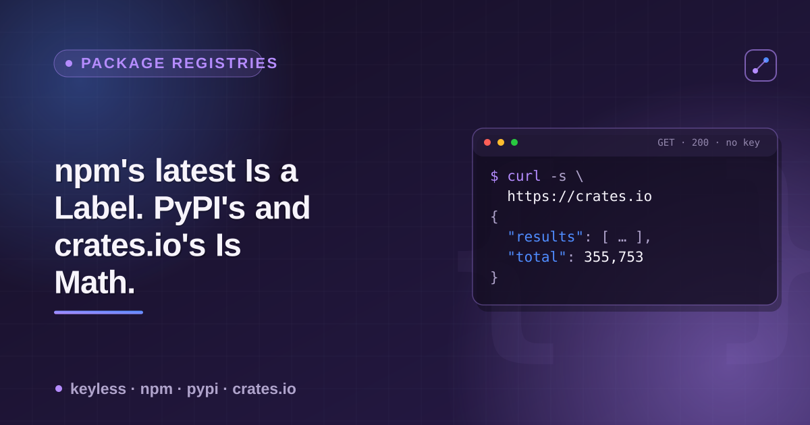

# npm, PyPI & crates.io "latest" semantics — a cheatsheet



"What version do I get if I don't ask for one in particular?" has three different
answers. npm exposes a `dist-tags` object — a set of maintainer-settable pointers,
one of which (`latest`) is what `npm install` uses by default, but it's a label,
not a computation. PyPI computes "latest" deterministically from PEP 440 version
ordering, with no field a maintainer can override. crates.io's actual registry
payload (the sparse index `cargo` reads) has no `latest` concept at all — the
client computes it. Checked live against real packages.

## Where each registry puts it

| Registry | Endpoint | "Latest" field | Settable by maintainer? | Other tags exist? |
|---|---|---|---|---|
| npm | `GET https://registry.npmjs.org/{name}` | `dist-tags.latest` | **Yes** — any tag, including `latest`, is `npm dist-tag add` | Yes — arbitrary, e.g. `next`, `beta`, `canary`, `legacy` |
| PyPI | `GET https://pypi.org/pypi/{name}/json` | `info.version` | **No** — computed from PEP 440 ordering of non-prerelease releases | No — no sibling field exists |
| crates.io | `GET https://index.crates.io/{shard-path}/{name}` (sparse index) | *(none)* | N/A — not stored | No — `cargo` computes highest non-yanked semver client-side |

## npm: `dist-tags` is a set of independent pointers, not one fact

```bash
curl -s https://registry.npmjs.org/react | python3 -c "
import json, sys
d = json.load(sys.stdin)
print(d['dist-tags'])
"
# {'beta': '19.0.0-beta-26f2496093-20240514', 'rc': '19.0.0-rc.1',
#  'next': '19.3.0-canary-d5736f09-20260507', 'backport': '19.0.8',
#  'latest': '19.3.0',
#  'experimental': '0.0.0-experimental-278794d7-20261002',
#  'canary': '19.3.0-canary-278794d7-20261002'}
```

Verified live 2026-10-05 — `dist-tags.latest` vs. the highest version string
present anywhere in the same package's `versions{}`:

| Package | `dist-tags.latest` | Highest version in `versions{}` | Match? |
|---|---|---|---|
| `react` | `19.3.0` | `19.3.0` ¹ | Yes |
| `vue` | `3.5.43` | `3.6.0-rc.10` | **No** |
| `angular` | `1.8.3` | `1.8.3` | Yes |
| `left-pad` | `1.3.0` | `1.3.0` | Yes |
| `node-sass` | `9.0.0` | `9.0.0` | Yes |
| `request` | `2.88.2` | `2.88.2` | Yes |
| `moment` | `2.31.0` | `2.31.0` | Yes |
| `express` | `5.2.1` | `5.2.1` | Yes |
| `lodash` | `4.18.1` | `4.18.1` | Yes |
| `is-odd` | `3.0.1` | `3.0.1` | Yes |
| `is-even` | `1.0.0` | `1.0.0` | Yes |
| `colors` | `1.4.0` | `1.4.0` | Yes |

¹ `react` publishes `19.3.0-canary-…` builds, but semver ranks a prerelease *below* the release it precedes, so `19.3.0` is the highest version. Compare with `semver --include-prerelease`, not string order.

Mismatch isn't registry-wide noise — it's specific to packages that ship a
canary/rc/next channel under the same name. 1 of 12 sampled here — `vue`,
whose `3.6.0` release candidates outrank its `latest` 3.5.43.

```bash
# list every tag a package currently has, not just "latest"
curl -s https://registry.npmjs.org/vue | python3 -c "
import json, sys
print(json.load(sys.stdin)['dist-tags'])
"
# {'csp': '1.0.28-csp', 'legacy': '2.7.16', 'v2-latest': '2.7.16',
#  'alpha': '3.6.0-alpha.7', 'beta': '3.6.0-beta.17',
#  'latest': '3.5.43', 'rc': '3.6.0-rc.10'}
```

Any npm package can define arbitrary tag names beyond `latest`/`next`/`beta` —
there's no fixed enum. `npm dist-tag ls <pkg>` shows the same data from the CLI.

## PyPI: `info.version` is arithmetic, not a setting

```bash
curl -s https://pypi.org/pypi/black/json | python3 -c "
import json, sys
d = json.load(sys.stdin)
print(d['info']['version'])
print(len(d['releases']), 'total release entries on record')
"
# 26.10.0
# 74 total release entries on record
```

Verified live 2026-10-05 across 5 packages with real prerelease history —
`info.version` always equals the highest non-prerelease release per PEP 440,
never a prerelease, with no field available to point it elsewhere:

| Package | `info.version` | Prerelease entries on record (sample) |
|---|---|---|
| `black` | `26.10.0` | `21.8b0`, `23.1a1`, `26.1a1` |
| `urllib3` | `2.8.0` | `2.0.0a1`–`2.0.0a4` |
| `Django` | `6.1.1` | `6.0b1`, `6.0rc1`, `6.1a1`, `6.1rc1` |
| `pip` | `26.2.1` | `20.2b1`, `24.1b1`, `24.1b2` |
| `numpy` | `2.5.3` | `1.0rc1`–`1.0rc3`, `2.5.0rc1` |

`pip install --pre pkg` will install a prerelease, but that's a client flag
choosing to opt into the full `releases{}` list — it doesn't change what
`info.version` reports.

## crates.io: the sparse index has no opinion to query

```bash
curl -s https://index.crates.io/se/rd/serde | tail -1
# {"name":"serde","vers":"1.0.229", ... ,"yanked":false,
#  "rust_version":"1.56","pubtime":"2026-07-18T23:05:13Z"}
```

This is the literal file `cargo` fetches — newline-delimited JSON, one line
per published version of `serde`, each carrying `vers`, `deps`, `cksum`,
`yanked`, and `pubtime`. There is no `latest` key in the file at any level.
`cargo` resolves "the newest usable version" entirely client-side: the
highest semver satisfying your `Cargo.toml` constraint whose `yanked` is
`false`. The registry server has nothing stored to override.

## Takeaway

| Registry | Who decides "latest"? | Can it point below the newest published artifact? |
|---|---|---|
| npm | The maintainer, per-tag, anytime | **Yes** — by design, for canary/rc/next channels |
| PyPI | PEP 440 version-ordering math | No — deterministic from the release list |
| crates.io | The client (`cargo`), per-request | No — no server-side concept exists |

If you're writing tooling that reads "the latest version" across these three
registries, `npm`'s answer is a maintainer-settable label and the other two
are closed-form computations. Treat `dist-tags.latest` as what the publisher
currently endorses, not as a synonym for "the newest code that exists."

---

Built this while working on
[`package-registry-scraper`](https://apify.com/ponderable_hydrometer/package-registry-scraper)
on Apify (keyless npm/PyPI/crates.io lookups as a dataset). Longer write-up with
the backstory: [dev.to article](https://dev.to/ronin13/npms-latest-is-a-label-a-maintainer-sets-pypis-and-cratesios-is-just-math).
